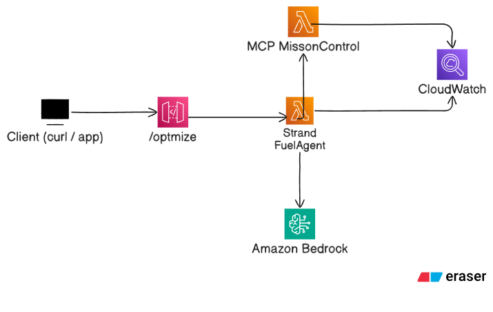

# Airline Fuel Optimization Agent in Lambda + Strands + MCP

## What this does
- Reads mock flight + weather + aircraft data.
- Computes baseline vs optimized altitude and projected fuel savings.
- Optionally publishes the recommendation to an SNS topic via an MCP server.

## How it is built
- **Strands Agents** orchestrates the agent loop and MCP tools. (pip: `strands-agents`)
- **MCP** client connects to an HTTP MCP server; server exposes `publish_recommendation`. (pip: `mcp`)
- **Lambda** runs the agent; **API Gateway** exposes `/optimize`.
- Optional **Lambda + Web Adapter** runs the MCP server (`/mcp`) and publishes to **SNS**.

## Architecture summary



## Demo

**Watch a demo** [here](https://drive.google.com/file/d/1RfUpryrSqu7hGz8PsFKkFYAI-TBBBV8K/view)

## Deploy

```
sam build
sam deploy --guided
```

Grab the `/optmize` endpoint and run using curl or postman with `"{\"flight_id\":\"FL1001\"}"` as body request

## Local test

```
sam build --use-container
sam local start-api
```

In a different terminal or using postman run:

```
curl -s -X POST http://127.0.0.1:3000/optimize -H "Content-Type: application/json" -d "{\"flight_id\":\"FL1001\"}"

curl -s -X POST http://127.0.0.1:3000/optimize -H "Content-Type: application/json" -d "{\"flight_id\":\"FL2002\"}"

curl -s -X POST http://127.0.0.1:3000/optimize -H "Content-Type: application/json" -d "{\"flight_id\":\"BADID\"}"
```

## Limitations
- Fuel model is intentionally simple (headwind penalty). Not operationally accurate.
- Weather is mocked. Replace with real METAR/TAF API later.
- Route re-planning is out of scope for this prototype (single leg great-circle).

## Next steps
- Fetch real METAR/TAF, winds aloft; add no-fly and turbulence constraints.
- Expand candidate altitudes; add basic reroute heuristics.
- Replace SNS with your operations bus; add audit trail (DynamoDB).